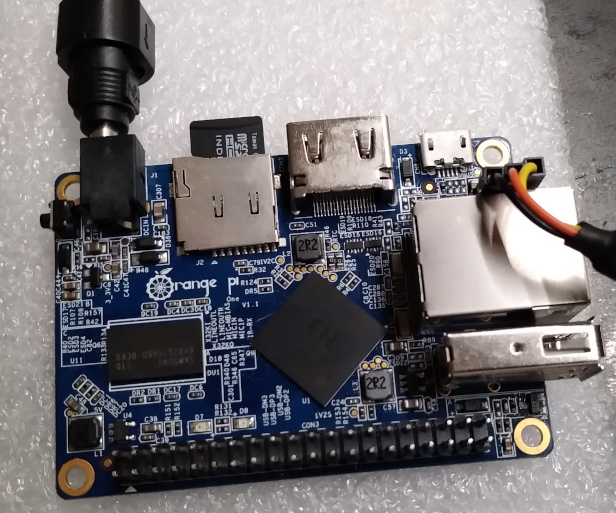
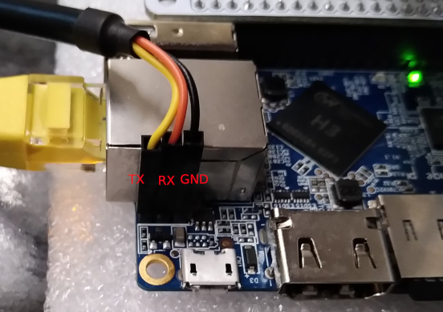
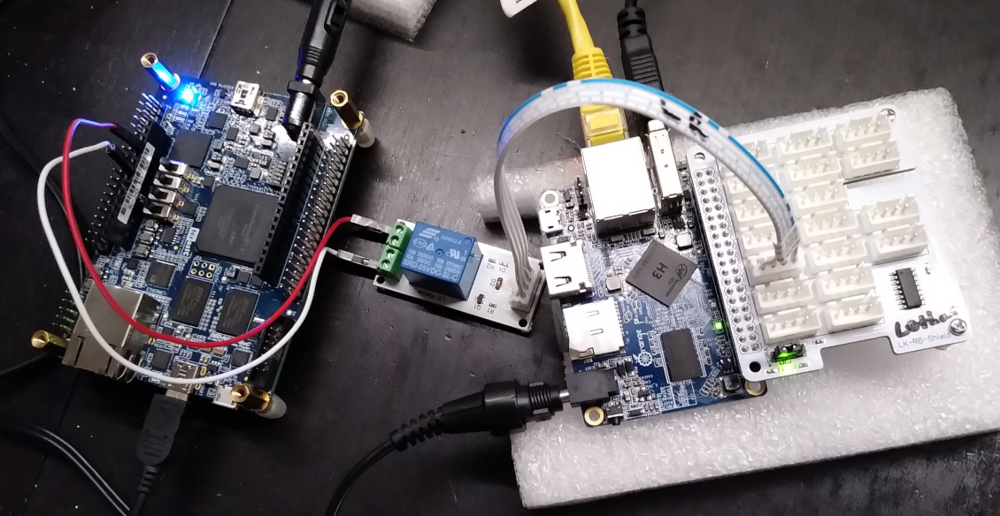

# Build Container for my OrangePi One

Contains a Dockerfile for building an docker image and its container for the OrangePi One using buildroot.  

Implicitely will run ```git clone --branch lothar/orangepi-devel https://github.com/Rubusch/buildroot.git``` inside the docker container.  




## Build


```
$ cd ./docker__buildroot/
$ time docker build --build-arg USER=$USER -t rubuschl/orangepi-buildroot:$(date +%Y%m%d%H%M%S) .
```

Use ```--no-cache``` when re-implementing the docker image.


## Usage

```
$ docker images
    REPOSITORY                  TAG                 IMAGE ID            CREATED             SIZE
    rubuschl/orangepi-buildroot 20191104161353      cbf4cb380168        24 minutes ago      10.5GB
    ubuntu                      xenial              5f2bf26e3524        4 days ago          123MB

$ time docker run --rm -ti --user=$USER:$USER --workdir=/home/$USER -v $PWD/dl:/home/$USER/buildroot/dl -v $PWD/output:/home/$USER/buildroot/output rubuschl/orangepi-buildroot:20191104161353
```

## Debug

```
$ docker images
    REPOSITORY                  TAG                 IMAGE ID            CREATED             SIZE
    rubuschl/orangepi-buildroot 20191104161353      cbf4cb380168        24 minutes ago      10.5GB
    ubuntu                      xenial              5f2bf26e3524        4 days ago          123MB

$ docker run --rm -ti --user=$USER:$USER --workdir=/home/$USER -v $PWD/dl:/home/$USER/buildroot/dl -v $PWD/output:/home/$USER/buildroot/output rubuschl/orangepi-buildroot:20191104161353 /bin/bash
```


## Image

For debugging the ``data abort`` issue when booting into the kernel, disassemble the u-boot to better understand what went wrong  

```
$ arm-linux-gnueabihf-objdump -sD u-boot > u-boot.txt
```

**NB**: alternatively, use kernel 5.2 and u-boot 2019.07 as minimum combination for the Orange Pi One.  

### Login



u: root  
p: N/A  


### Example: Use the OrangePi as lowcost Remote Lab Automation Solution

Needed: Linkerkit Relais Shield, relais and cable, some wires  



control the target device via OrangePi and Linker Kit Shield:  
 *  eth: connect the OrangePi via ssh connection, pick up the screen session (serial) or powercycle the target (gpio)
 *  pm: use LK shield and relais to powercycle the target board, here a Cyclone V SoC-FPGA Board
 *  serial: setup a ``screen`` session via usb-to-serial-altera-uart to the target, detach and attach as needed


#### Configuration

make sure the kernel has ``CONFIG_SERIAL_ALTERA_UART`` set, it's benefitial also to turn on additional things such as ``/proc/config.gz`` support - TODO verify   

make sure the board has the following onboard:  
 *  ``screen``
 *  ``dropbear``
 *  ``usb/serial`` support (drivers -> usb drivers -> section serial, enable generic support (/dev/ttyUSB0 will appear
 *  ``eudev + tempfs`` Build (convenience)
 * turn off taking eth0 to automatic dhcp (when using fixed IP addresses)

some gpio libs/tools might be helpful, find the following gpio numbering mapped to the pin numbering  


in case, configure network and/or set a root password   

```
# vi /etc/network/interfaces

auto lo
iface lo inet loopback

auto eth0
iface eth0 inet static
address 192.168.200.20
netmask 255.255.255.0
```

in case, place a ``powercycle.sh`` script in /root  
```
# vi /root/powercycle.sh

#!/bin/sh
GPIO=/sys/class/gpio/gpio10/value
echo 1 > $GPIO
sleep 1
echo 0 > $GPIO
```

#### Setting gpio10 as an example

gpio10 will trigger on pin 19, make the gpio accessible, then set access direction "out" (write) or "in" (reading)  

then configure the following on the board  

```
$ echo 10 > /sys/class/gpio/export
$ echo "out" > /sys/class/gpio/gpio10/direction
```

turn on  

```
$ echo 1 > /sys/class/gpio/gpio10/value
```

turn off  

```
$ echo 0 > /sys/class/gpio/gpio10/value
```

