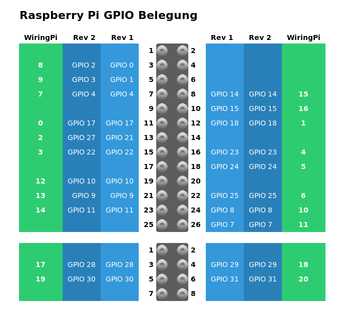

# Build Container for my OrangePi One

Contains a Dockerfile for building an docker image and its container for the OrangePi One using buildroot.

Implicitely will run ```git clone --branch lothar/orangepi-devel https://github.com/Rubusch/buildroot.git``` inside the docker container.


## Build


```
$ cd ./docker__buildroot/
$ time docker build --build-arg USER=$USER -t rubuschl/orangepi-buildroot:$(date +%Y%m%d%H%M%S) .
```

Use ```--no-cache``` when re-implementing the docker image.


## Usage

```
$ docker images
    REPOSITORY                  TAG                 IMAGE ID            CREATED             SIZE
    rubuschl/orangepi-buildroot 20191104161353      cbf4cb380168        24 minutes ago      10.5GB
    ubuntu                      xenial              5f2bf26e3524        4 days ago          123MB

$ time docker run --rm -ti --user=$USER:$USER --workdir=/home/$USER -v $PWD/dl:/home/$USER/buildroot/dl -v $PWD/output:/home/$USER/buildroot/output rubuschl/orangepi-buildroot:20191104161353
```

## Debug

```
$ docker images
    REPOSITORY                  TAG                 IMAGE ID            CREATED             SIZE
    rubuschl/orangepi-buildroot 20191104161353      cbf4cb380168        24 minutes ago      10.5GB
    ubuntu                      xenial              5f2bf26e3524        4 days ago          123MB

$ docker run --rm -ti --user=$USER:$USER --workdir=/home/$USER -v $PWD/dl:/home/$USER/buildroot/dl -v $PWD/output:/home/$USER/buildroot/output rubuschl/orangepi-buildroot:20191104161353 /bin/bash
```


## Image

For debugging the ``data abort`` issue when booting into the kernel, disassemble the u-boot to better understand what went wrong  

```
$ arm-linux-gnueabihf-objdump -sD u-boot > u-boot.txt
```

**NB**: alternatively, use kernel 5.2 and u-boot 2019.07 as minimum combination for the Orange Pi One.  

### Login

u: root  
p: N/A  


### Linkerkit Relais Shield

TODO: setup.jpg

find the following gpio numbering mapped to the pin numbering  


